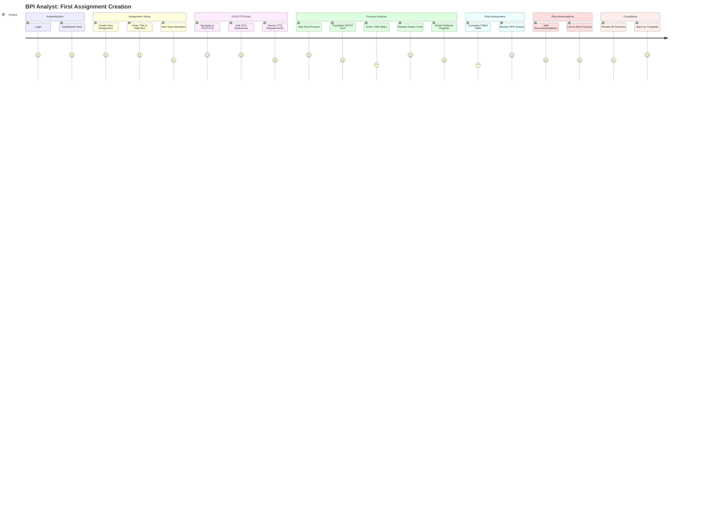
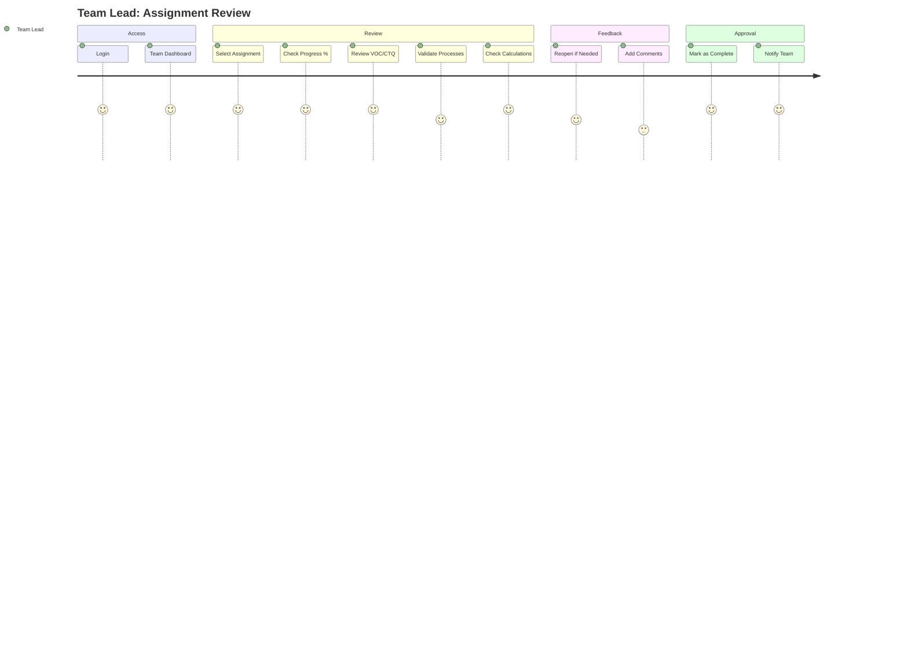
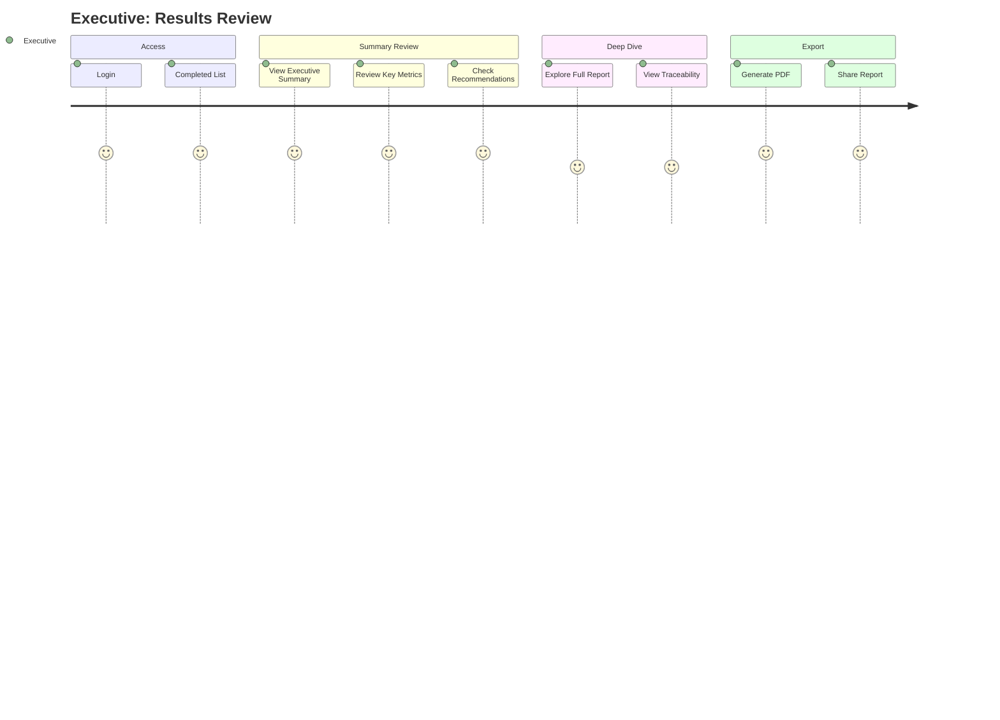

# BPI Assignment Platform - UX/UI Design Document

**Version:** 1.0
**Date:** 2025-09-30
**Prepared by:** Sally (UX Expert) 🎨

---

## Executive Summary

This document defines the complete user experience and interface design for the BPI Assignment Platform, a Six Sigma workflow automation tool. The design follows a **minimalist black and white aesthetic** with white backgrounds and black text, using shadcn/ui components to create a professional, data-centric interface that prioritizes clarity and efficiency.

### Design Principles

1. **Data-First Design** - Visual elements never compete with analytical content
2. **Progressive Disclosure** - Reveal complexity only when needed
3. **Story-Driven Navigation** - Follow the Six Sigma narrative flow
4. **Instant Feedback** - Real-time updates for all user actions
5. **Accessibility by Default** - WCAG AA compliance in every component

---

## Visual Design System

### Color Palette

```css
/* Primary Colors */
--background: #FFFFFF;      /* White - Main background */
--foreground: #000000;      /* Black - Primary text */

/* Grayscale */
--gray-50: #FAFAFA;        /* Subtle backgrounds */
--gray-100: #F5F5F5;       /* Table stripes, hover states */
--gray-200: #E5E5E5;       /* Borders */
--gray-300: #D4D4D4;       /* Disabled borders */
--gray-400: #A3A3A3;       /* Placeholder text */
--gray-500: #737373;       /* Secondary text */
--gray-600: #525252;       /* Icons */
--gray-700: #404040;       /* Emphasized text */
--gray-800: #262626;       /* Headers */
--gray-900: #171717;       /* Maximum contrast */

/* Semantic Colors (minimal use) */
--success: #000000;        /* Black checkmark icon */
--warning: #737373;        /* Gray warning icon */
--error: #000000;          /* Black error icon with text */
--info: #525252;           /* Gray info icon */
```

### Typography

```css
/* Font Stack */
font-family: system-ui, -apple-system, 'Segoe UI', Roboto, sans-serif;

/* Type Scale */
--text-xs: 0.75rem;     /* 12px - Captions, labels */
--text-sm: 0.875rem;    /* 14px - Secondary text */
--text-base: 1rem;      /* 16px - Body text */
--text-lg: 1.125rem;    /* 18px - Emphasized body */
--text-xl: 1.25rem;     /* 20px - Section headers */
--text-2xl: 1.5rem;     /* 24px - Page titles */
--text-3xl: 1.875rem;   /* 30px - Dashboard headers */

/* Font Weights */
--font-normal: 400;     /* Body text */
--font-medium: 500;     /* Labels, buttons */
--font-semibold: 600;   /* Headers */
--font-bold: 700;       /* Page titles */

/* Line Heights */
--leading-tight: 1.25;   /* Headers */
--leading-normal: 1.5;   /* Body text */
--leading-relaxed: 1.75; /* Long-form content */
```

### Spacing System

```css
/* 8px base unit */
--space-0: 0;
--space-1: 0.25rem;  /* 4px */
--space-2: 0.5rem;   /* 8px */
--space-3: 0.75rem;  /* 12px */
--space-4: 1rem;     /* 16px */
--space-5: 1.25rem;  /* 20px */
--space-6: 1.5rem;   /* 24px */
--space-8: 2rem;     /* 32px */
--space-10: 2.5rem;  /* 40px */
--space-12: 3rem;    /* 48px */
--space-16: 4rem;    /* 64px */
```

### Component Styling

All components follow the black/white theme with these patterns:

```typescript
// Button variants
primary: "bg-black text-white hover:bg-gray-800"
secondary: "bg-white text-black border-2 border-black hover:bg-gray-50"
ghost: "bg-transparent text-black hover:bg-gray-100"
disabled: "bg-gray-200 text-gray-400 cursor-not-allowed"

// Input styles
default: "bg-white border-gray-300 text-black focus:border-black"
error: "bg-white border-black text-black"
disabled: "bg-gray-50 border-gray-200 text-gray-400"

// Table styles
header: "bg-gray-50 border-b-2 border-black font-semibold"
row: "bg-white border-b border-gray-200 hover:bg-gray-50"
striped: "even:bg-gray-50"
```

---

## User Journey Maps

### Journey 1: BPI Analyst - Creating First Assignment



**Key Touchpoints:**
1. **First Time Experience**: Guided tooltips on first assignment creation
2. **Progressive Disclosure**: Tabs unlock as sections are completed
3. **Auto-save Indicators**: Constant feedback on save status
4. **Calculation Transparency**: Tooltips explain all automated calculations

### Journey 2: Team Lead - Review and Approval



### Journey 3: Executive - Stakeholder Review



---

## Information Architecture

### Navigation Hierarchy

```
Root
├── Authentication
│   └── Login
│
├── Dashboard (Role-based)
│   ├── BPI Team Dashboard
│   ├── Team Lead Dashboard
│   └── Executive Dashboard
│
├── Assignments
│   ├── Assignment List
│   ├── New Assignment
│   └── Assignment Detail
│       ├── VOC/CTQ
│       ├── Processes (Dynamic)
│       │   ├── Process 1
│       │   │   ├── SIPOC
│       │   │   ├── VSM
│       │   │   ├── Pareto
│       │   │   ├── Fishbone
│       │   │   └── Capability
│       │   └── Process N...
│       ├── FMEA
│       ├── Recommendations
│       ├── Summary (Executive default)
│       └── Audit Log (Team Lead only)
│
└── User Settings
    └── Profile
```

### URL Structure

```
/login                                          - Public authentication
/assignments                                    - Assignment dashboard
/assignments/new                                - Create assignment
/assignments/[id]                              - Assignment container
/assignments/[id]/voc                          - VOC/CTQ section
/assignments/[id]/processes/[pid]/sipoc       - SIPOC for process
/assignments/[id]/processes/[pid]/vsm         - VSM for process
/assignments/[id]/processes/[pid]/pareto      - Pareto chart
/assignments/[id]/processes/[pid]/fishbone    - Fishbone diagram
/assignments/[id]/processes/[pid]/capability  - Process capability
/assignments/[id]/fmea                        - FMEA table
/assignments/[id]/recommendations             - Recommendations
/assignments/[id]/summary                     - Executive summary
/assignments/[id]/audit                       - Audit log
```

---

## Core Screen Designs

### 1. Login Screen

**Layout:** Centered card on white background

```
┌──────────────────────────────────────────────────────┐
│                                                      │
│                  BPI Assignment Platform             │
│                 ━━━━━━━━━━━━━━━━━━━━━━━             │
│                                                      │
│           ┌─────────────────────────────┐           │
│           │  Email                      │           │
│           └─────────────────────────────┘           │
│                                                      │
│           ┌─────────────────────────────┐           │
│           │  Password                   │           │
│           └─────────────────────────────┘           │
│                                                      │
│           ┌─────────────────────────────┐           │
│           │         Sign In             │           │
│           └─────────────────────────────┘           │
│                                                      │
│                Six Sigma Workflow Automation         │
│                                                      │
└──────────────────────────────────────────────────────┘
```

**Components:**
- Card container: White background, thin black border
- Input fields: White background, gray border, black text
- Button: Black background, white text
- Typography: Black text on white

### 2. Assignment Dashboard

**Layout:** Full-width table with action bar

```
┌─────────────────────────────────────────────────────────────┐
│ BPI Assignment Platform        User Name [Role] | Sign Out │
├─────────────────────────────────────────────────────────────┤
│                                                             │
│ Assignments                              [+ New Assignment] │
│                                                             │
│ Filter: [All Status ▼] [All Users ▼]           Search: [  ]│
│                                                             │
│ ┌───────────────────────────────────────────────────────┐ │
│ │ Title          Status    Modified    Owner    Actions │ │
│ ├───────────────────────────────────────────────────────┤ │
│ │ Order Process  DRAFT     2h ago      John     [Open]  │ │
│ ├───────────────────────────────────────────────────────┤ │
│ │ Shipping Flow  COMPLETED 1d ago      Sarah    [View]  │ │
│ ├───────────────────────────────────────────────────────┤ │
│ │ Returns Study  DRAFT     3d ago      Mike     [Open]  │ │
│ └───────────────────────────────────────────────────────┘ │
│                                                             │
│ Showing 1-3 of 3                           [Previous][Next] │
└─────────────────────────────────────────────────────────────┘
```

### 3. Assignment Editor Container

**Layout:** Header with tabs, content area below

```
┌─────────────────────────────────────────────────────────────┐
│ ← Back to Assignments                                      │
│                                                             │
│ Order Fulfillment Process Analysis          [DRAFT]        │
│ Objective: Reduce order cycle time by 30%                  │
│                                                             │
│ [Save] [Mark as Complete]           ✓ All changes saved    │
│                                                             │
│ ┌─────────────────────────────────────────────────────┐   │
│ │ VOC/CTQ | Process ▼ | FMEA | Recommendations       │   │
│ │          │ - Order Entry                            │   │
│ │          │ - Fulfillment                            │   │
│ │          │ + Add Process                            │   │
│ └─────────────────────────────────────────────────────┘   │
│                                                             │
│ ┌─────────────────────────────────────────────────────┐   │
│ │                                                      │   │
│ │                   Content Area                       │   │
│ │                                                      │   │
│ └─────────────────────────────────────────────────────┘   │
└─────────────────────────────────────────────────────────────┘
```

### 4. VOC/CTQ Form

**Layout:** Two-section form with tables

```
┌─────────────────────────────────────────────────────────────┐
│ Voice of Customer (VOC)                    [+ Add Statement]│
│                                                             │
│ ┌───────────────────────────────────────────────────────┐ │
│ │ Customer Segment    Voice Statement           Actions │ │
│ ├───────────────────────────────────────────────────────┤ │
│ │ Online Shoppers     Orders take too long      [✏][🗑] │ │
│ ├───────────────────────────────────────────────────────┤ │
│ │ B2B Clients         Need tracking visibility   [✏][🗑] │ │
│ └───────────────────────────────────────────────────────┘ │
│                                                             │
│ Critical to Quality (CTQ)                [+ Add Requirement]│
│                                                             │
│ ┌───────────────────────────────────────────────────────┐ │
│ │ CTQ Description     Measurement     Target    Actions │ │
│ ├───────────────────────────────────────────────────────┤ │
│ │ Order cycle time    Days            < 3 days  [✏][🗑] │ │
│ ├───────────────────────────────────────────────────────┤ │
│ │ Tracking accuracy   % accurate      > 99%     [✏][🗑] │ │
│ └───────────────────────────────────────────────────────┘ │
└─────────────────────────────────────────────────────────────┘
```

### 5. SIPOC Grid Editor

**Layout:** 5-column grid with toggle for visual mode

```
┌─────────────────────────────────────────────────────────────┐
│ SIPOC Diagram                    [Grid View] [Visual View] │
│                                                             │
│ ┌──────────┬──────────┬──────────┬──────────┬──────────┐ │
│ │Suppliers │ Inputs   │ Process  │ Outputs  │Customers │ │
│ ├──────────┼──────────┼──────────┼──────────┼──────────┤ │
│ │Warehouse │Inventory │Pick Items│Shipment  │End User  │ │
│ │          │          │          │          │          │ │
│ │Vendor    │Orders    │Pack Box  │Invoice   │Business  │ │
│ │          │          │          │          │          │ │
│ │IT System │Data      │Label     │Tracking# │Support   │ │
│ │          │          │          │          │          │ │
│ │[+ Add]   │[+ Add]   │[+ Add]   │[+ Add]   │[+ Add]   │ │
│ └──────────┴──────────┴──────────┴──────────┴──────────┘ │
└─────────────────────────────────────────────────────────────┘
```

**Visual Mode (using react-flow):**
```
┌─────────────────────────────────────────────────────────────┐
│ SIPOC Process Flow                                         │
│                                                             │
│  [Suppliers] ──→ [Inputs] ──→ [Process] ──→ [Outputs] ──→ [Customers]
│                                                             │
│  Zoom: [−][▢][+]                           Export as PNG   │
└─────────────────────────────────────────────────────────────┘
```

### 6. VSM Data Entry Table

**Layout:** Data table with summary metrics

```
┌─────────────────────────────────────────────────────────────┐
│ Value Stream Map                                           │
│                                                             │
│ Summary Metrics                                            │
│ ┌───────────────────────────────────────────────────────┐ │
│ │ Total Time: 480 min | Value-Added: 120 min (25%)     │ │
│ │ Non-Value: 360 min (75%) | Efficiency: 25%           │ │
│ └───────────────────────────────────────────────────────┘ │
│                                                             │
│ Process Steps                                   [+ Add Step]│
│ ┌───────────────────────────────────────────────────────┐ │
│ │ # │ Step Name      │ Duration │ Wait │ VA? │ Actions │ │
│ ├───────────────────────────────────────────────────────┤ │
│ │ 1 │ Receive Order  │ 5 min    │ 0    │ ☐   │ [⋮][🗑] │ │
│ ├───────────────────────────────────────────────────────┤ │
│ │ 2 │ Pick Items     │ 30 min   │ 60   │ ☑   │ [⋮][🗑] │ │
│ └───────────────────────────────────────────────────────┘ │
└─────────────────────────────────────────────────────────────┘
```

### 7. Pareto Chart View

**Layout:** Full-width chart with data table

```
┌─────────────────────────────────────────────────────────────┐
│ Pareto Analysis - Process Steps by Duration                │
│                                                             │
│     Duration (min)                        Cumulative %     │
│ 120 ┤■■■■■■■■■■■■■■■■■■■■                      100%     │
│     │                                      ....●         │
│ 90  ┤        ■■■■■■■■■■■■              ....●    80%      │
│     │                           ....●                     │
│ 60  ┤               ■■■■■■  ....●               60%      │
│     │                   ....●    ─ ─ ─ ─ ─ ─ ─ ─        │
│ 30  ┤         ■■■■  ....●                       40%      │
│     │         ....●                                       │
│ 0   └────────────────────────────────────────    20%      │
│      Wait Time  Pick Items  Pack Box  Label               │
│                                                             │
│ 80% of cycle time comes from: Wait Time, Pick Items        │
│                                              [Export PNG]  │
└─────────────────────────────────────────────────────────────┘
```

### 8. Fishbone Diagram Builder

**Layout:** Category accordion with visual toggle

```
┌─────────────────────────────────────────────────────────────┐
│ Fishbone Diagram                  [Table View][Visual View]│
│                                                             │
│ Effect: High Order Cycle Time                              │
│                                                             │
│ ▼ People                                                   │
│   • Insufficient training                          [✏][🗑] │
│   • Low motivation                                 [✏][🗑] │
│   [+ Add Cause]                                            │
│                                                             │
│ ▼ Process                                                  │
│   • Manual order entry                             [✏][🗑] │
│   • No standard procedures                         [✏][🗑] │
│   [+ Add Cause]                                            │
│                                                             │
│ ▶ Equipment                                                │
│ ▶ Materials                                                │
│ ▶ Environment                                              │
│ ▶ Management                                               │
└─────────────────────────────────────────────────────────────┐
```

**Visual Mode (react-flow):**
```
┌─────────────────────────────────────────────────────────────┐
│                     High Order Cycle Time                  │
│        People ───────────┤├───────────── Equipment        │
│       Process ───────────┤├───────────── Materials        │
│   Environment ───────────┤├───────────── Management       │
│                                                             │
│  Zoom: [−][▢][+]                           Export as PNG   │
└─────────────────────────────────────────────────────────────┘
```

### 9. Process Capability Dashboard

**Layout:** Input form with metrics cards and chart

```
┌─────────────────────────────────────────────────────────────┐
│ Process Capability Analysis                                │
│                                                             │
│ Specification Limits                                       │
│ LSL: [20.0] USL: [50.0] Target: [35.0]                    │
│                                                             │
│ Sample Statistics                                          │
│ Mean (μ): [34.5] Std Dev (σ): [2.5]                       │
│                                                             │
│ ┌─────────┬─────────┬──────────┐                         │
│ │ Cp      │ Cpk     │ Sigma    │                         │
│ │ 2.00    │ 1.80    │ 6.9      │                         │
│ │ ✓ Good  │ ✓ Good  │ ✓ Good   │                         │
│ └─────────┴─────────┴──────────┘                         │
│                                                             │
│ Process Distribution                                       │
│      ┌─────────────────────────────────┐                 │
│      │        ╱╲      LSL│ T │USL      │                 │
│      │       ╱  ╲        │ │ │         │                 │
│      │      ╱    ╲       │ │ │         │                 │
│      │     ╱      ╲      │ │ │         │                 │
│      │____╱        ╲_____│_│_│_______  │                 │
│      └─────────────────────────────────┘                 │
└─────────────────────────────────────────────────────────────┘
```

### 10. FMEA Table Editor

**Layout:** Sortable data table with RPN calculation

```
┌─────────────────────────────────────────────────────────────┐
│ Failure Mode and Effects Analysis              [+ Add Mode]│
│                                                             │
│ Filter by Process: [All Processes ▼]                      │
│                                                             │
│ ┌───────────────────────────────────────────────────────┐ │
│ │ Failure Mode │ S │ O │ D │ RPN │ Actions            │ │
│ ├───────────────────────────────────────────────────────┤ │
│ │ Wrong items  │ 8 │ 6 │ 3 │ 144 │ [✏][🗑]            │ │
│ ├───────────────────────────────────────────────────────┤ │
│ │ Late delivery│ 7 │ 5 │ 4 │ 140 │ [✏][🗑]            │ │
│ └───────────────────────────────────────────────────────┘ │
│                                                             │
│ Legend: S=Severity(1-10) O=Occurrence(1-10) D=Detection   │
│ RPN = S × O × D (Red ≥200, Yellow 100-199, Green <100)    │
└─────────────────────────────────────────────────────────────┘
```

### 11. Recommendations Form

**Layout:** Card-based list with form modal

```
┌─────────────────────────────────────────────────────────────┐
│ Recommendations                        [+ Add Recommendation]│
│                                                             │
│ ┌───────────────────────────────────────────────────────┐ │
│ │ Implement Barcode Scanning                            │ │
│ │ Difficulty: MEDIUM | Savings: $50K/year               │ │
│ │                                                        │ │
│ │ Reduce picking errors by 90% through automated        │ │
│ │ barcode verification at each step...                  │ │
│ │                                                        │ │
│ │ Addresses: 3 FMEA risks, 2 root causes    [View][Edit]│ │
│ └───────────────────────────────────────────────────────┘ │
│                                                             │
│ ┌───────────────────────────────────────────────────────┐ │
│ │ Optimize Warehouse Layout                             │ │
│ │ Difficulty: LOW | Savings: $20K/year                  │ │
│ │                                                        │ │
│ │ Reorganize frequently picked items to reduce          │ │
│ │ travel time by 40%...                                 │ │
│ │                                                        │ │
│ │ Addresses: 2 FMEA risks, 3 root causes    [View][Edit]│ │
│ └───────────────────────────────────────────────────────┘ │
└─────────────────────────────────────────────────────────────┘
```

### 12. Executive Summary View

**Layout:** Dashboard-style metrics overview

```
┌─────────────────────────────────────────────────────────────┐
│ Executive Summary - Order Fulfillment Process              │
│                                                             │
│ Key Metrics                                                │
│ ┌─────────┬─────────┬─────────┬─────────┐                │
│ │ Cycle   │ Defect  │ Process │ Top RPN │                │
│ │ 480 min │ 5.2%    │ Cpk 1.8 │ 144     │                │
│ └─────────┴─────────┴─────────┴─────────┘                │
│                                                             │
│ Critical Findings                                          │
│ • 75% of cycle time is non-value-added                     │
│ • Wait time between steps accounts for 40% of total        │
│ • Manual processes cause 60% of errors                     │
│                                                             │
│ Top Recommendations                                        │
│ 1. Implement barcode scanning (ROI: $50K/year)            │
│ 2. Optimize warehouse layout (ROI: $20K/year)             │
│ 3. Automate order entry (ROI: $30K/year)                  │
│                                                             │
│ [View Full Report] [Export PDF]                           │
└─────────────────────────────────────────────────────────────┘
```

---

## Component Library

### Core Components

```typescript
// Button Component
<Button variant="primary|secondary|ghost" size="sm|md|lg">
  Black primary, white text | White with black border | Transparent
</Button>

// Input Component
<Input
  type="text|number|email"
  error={boolean}
  placeholder="Gray placeholder text"
/>

// Table Component
<Table striped={boolean}>
  <TableHeader>Black text on gray-50 background</TableHeader>
  <TableRow hover>White background, gray-50 on hover</TableRow>
</Table>

// Card Component
<Card>
  White background, gray-200 border, subtle shadow
</Card>

// Badge Component
<Badge variant="default|success|warning|error">
  Gray background with black text variations
</Badge>

// Dialog Component
<Dialog>
  White background, black overlay at 50% opacity
</Dialog>

// Tabs Component
<Tabs>
  <TabsList>Gray-100 background</TabsList>
  <TabsTrigger>Black text, underline when active</TabsTrigger>
</Tabs>

// Tooltip Component
<Tooltip>
  Black background, white text, small arrow
</Tooltip>
```

### State Indicators

```typescript
// Auto-save States
saving: "Saving..." // Gray-600 text with spinner
saved: "✓ All changes saved" // Black checkmark
error: "✗ Save failed" // Black X with error text

// Assignment Status
draft: "DRAFT" // Gray-700 background
completed: "COMPLETED" // Black background, white text
reopened: "REOPENED" // Gray-500 background

// Validation States
valid: Black border
invalid: Thicker black border with error icon
disabled: Gray-300 border, gray-50 background
```

---

## Interaction Patterns

### Auto-Save Flow

```
User Action → Debounce (2s) → API Call → Update Indicator

States:
1. Idle: No indicator
2. Unsaved: Yellow dot
3. Saving: "Saving..." with spinner
4. Saved: "✓ All changes saved"
5. Error: "✗ Save failed - retrying"
```

### Progressive Disclosure

```
VOC/CTQ (Always visible)
    ↓ Complete
Process Tab (Unlocks)
    ↓ Add Process
    SIPOC → VSM → Pareto → Fishbone → Capability
    ↓ Complete all
FMEA Tab (Unlocks)
    ↓ Complete
Recommendations (Unlocks)
```

### Drag and Drop

```
Drag Handle (⋮⋮) → Grab → Move → Drop → Reorder API → Update UI

Visual feedback:
- Grab: Cursor changes to grabbing
- Moving: Item becomes semi-transparent
- Valid drop zone: Black dashed border
- Invalid zone: No visual change
```

---

## Responsive Design

### Breakpoints

```css
/* Mobile First Approach */
sm: 640px   /* Tablet portrait */
md: 768px   /* Tablet landscape */
lg: 1024px  /* Desktop (PRIMARY TARGET) */
xl: 1280px  /* Large desktop */
2xl: 1536px /* Extra large screens */
```

### Desktop Priority (1024px+)

Primary layout with full features:
- Multi-column tables
- Side-by-side panels
- Full navigation visible
- All interactions enabled

### Tablet Adaptation (768px-1023px)

Simplified but functional:
- Single column layout
- Collapsible navigation
- Touch-optimized buttons (44px targets)
- Responsive tables with horizontal scroll

### Mobile (Future - Phase 2)

Basic read-only access:
- Stack all content vertically
- Hamburger menu navigation
- View-only for completed assignments
- PDF export only

---

## Accessibility Guidelines

### WCAG AA Compliance

#### Color Contrast
- Normal text: 7:1 ratio (Black on white = 21:1 ✓)
- Large text: 4.5:1 ratio (Exceeded ✓)
- UI components: 3:1 ratio (Black borders ✓)

#### Keyboard Navigation
```
Tab order follows visual hierarchy
Enter/Space activates buttons
Arrow keys navigate within components
Escape closes modals/dropdowns
Focus visible with black outline
```

#### Screen Reader Support
```html
<!-- Semantic HTML -->
<main role="main">
<nav role="navigation">
<button aria-label="Add new VOC statement">
<table role="table" aria-label="FMEA entries sorted by RPN">

<!-- Live regions for updates -->
<div aria-live="polite" aria-atomic="true">
  All changes saved
</div>

<!-- Form associations -->
<label for="voc-statement">Voice Statement</label>
<input id="voc-statement" aria-required="true">
```

#### Focus Management
- Focus trapped in modals
- Focus returns to trigger after modal close
- Skip links to main content
- Focus visible indicators (black outline)

---

## Implementation Guidelines

### Component Development Order

**Phase 1: Foundation**
1. Theme configuration (colors, typography)
2. Base shadcn/ui components
3. Layout components (Header, Navigation)
4. Authentication flow

**Phase 2: Core Workflow**
1. Assignment dashboard
2. VOC/CTQ forms
3. SIPOC grid
4. VSM table
5. Pareto chart (Recharts)

**Phase 3: Advanced Features**
1. Fishbone builder (react-flow)
2. FMEA table with calculations
3. Process capability dashboard
4. Recommendations with traceability

**Phase 4: Polish**
1. Executive summary
2. PDF export
3. Audit log
4. Performance optimizations

### CSS Architecture

```scss
// Global styles
@layer base {
  :root {
    --background: 255 255 255;
    --foreground: 0 0 0;
  }
}

// Component styles (via shadcn/ui)
@layer components {
  .card {
    @apply bg-white border border-gray-200 rounded-lg shadow-sm;
  }
}

// Utility overrides
@layer utilities {
  .text-muted {
    @apply text-gray-600;
  }
}
```

### Performance Considerations

1. **Code Splitting**: Dynamic imports for heavy components (charts, react-flow)
2. **Virtualization**: For long tables (>100 rows)
3. **Debouncing**: Auto-save, search, filters (2-second delay)
4. **Memoization**: Expensive calculations (Pareto, capability)
5. **Progressive Enhancement**: Server-side rendering for initial load

### Testing Strategy

1. **Visual Regression**: Percy/Chromatic for UI consistency
2. **Accessibility**: axe-core automated testing
3. **Interaction**: Playwright for user flows
4. **Component**: Storybook for isolated testing

---

## Appendix

### Icon Set (Lucide React)

```
Navigation: ChevronDown, ChevronRight, ArrowLeft, Menu
Actions: Plus, Edit2, Trash2, Save, Download, Share
Status: Check, X, AlertCircle, Info, Loader
Data: BarChart2, TrendingUp, Filter, Search
UI: Settings, User, LogOut, HelpCircle, ExternalLink
```

### Animation Guidelines

```css
/* Subtle transitions only */
transition-duration: 150ms;
transition-timing-function: ease-in-out;

/* Loading states */
@keyframes spin {
  from { transform: rotate(0deg); }
  to { transform: rotate(360deg); }
}

/* No decorative animations */
/* No parallax effects */
/* No auto-playing content */
```

### Error States

```
Network Error: "Connection failed. Please check your network."
Validation: "This field is required" (below input)
Permission: "You don't have permission to perform this action"
System: "Something went wrong. Please try again."
```

---

## Conclusion

This UX/UI design document provides a comprehensive blueprint for implementing the BPI Assignment Platform with a clean, professional black and white aesthetic. The design prioritizes data clarity, workflow efficiency, and user productivity while maintaining strict accessibility standards.

The minimalist approach ensures that analytical content remains the focus, while interactive elements using react-flow for visual diagrams provide powerful data visualization capabilities when needed. The progressive disclosure pattern guides users through the Six Sigma methodology naturally, and real-time feedback keeps users informed of system status at all times.

---

*Document prepared by Sally (UX Expert) 🎨*
*Version 1.0 - 2025-09-30*